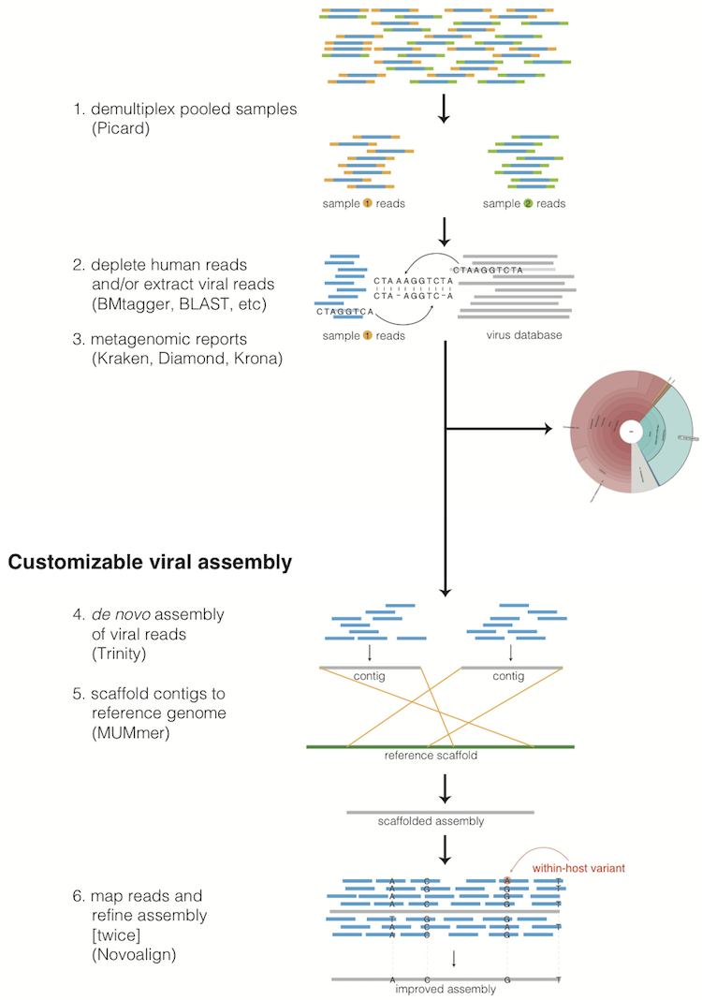

Description of the methods
==========================

Taxonomic read filtration
-------------------------

Human, contaminant, and duplicate read removal
~~~~~~~~~~~~~~~~~~~~~~~~~~~~~~~~~~~~~~~~~~~~~~

The assembly pipeline begins by depleting paired-end reads from each
sample of human and other contaminants using BMTAGGER_ and BLASTN_,
and removing PCR duplicates using M-Vicuna (a custom version of Vicuna_).

.. _BMTAGGER: http://ftp.ncbi.nih.gov/pub/agarwala/bmtagger/screening.pdf
.. _BLASTN: https://blast.ncbi.nlm.nih.gov/Blast.cgi?PAGE_TYPE=BlastSearch
.. _Vicuna: http://www.broadinstitute.org/scientific-community/science/projects/viral-genomics/vicuna

Taxonomic selection
~~~~~~~~~~~~~~~~~~~

Reads are then filtered to to a genus-level database using LASTAL_,
quality-trimmed with Trimmomatic_,
and further deduplicated with PRINSEQ_.

.. _LASTAL: http://last.cbrc.jp
.. _Trimmomatic: http://www.usadellab.org/cms/?page=trimmomatic
.. _PRINSEQ: http://prinseq.sourceforge.net

Viral genome analysis
---------------------

Viral genome assembly
~~~~~~~~~~~~~~~~~~~~~

The filtered and trimmed reads are subsampled to at most 100,000 pairs.
*de novo* assemby is performed using Trinity_. SPAdes_ is also offered as
an alternative *de novo* assembler.
Reference-assisted assembly improvements follow (contig scaffolding, orienting, etc.)
with MUMMER_ and MUSCLE_ or MAFFT_. Gap2Seq_ is used to seal gaps between scaffolded *de novo* contigs with sequencing reads.

Each sample's reads are aligned to its *de novo* assembly using Novoalign_
and any remaining duplicates were removed using Picard_ MarkDuplicates.
Variant positions in each assembly were identified using GATK_ IndelRealigner and
UnifiedGenotyper on the read alignments. The assembly was refined to represent the
major allele at each variant site, and any positions supported by fewer than three
reads were changed to N.

This align-call-refine cycle is iterated twice, to minimize reference bias in the assembly.
 
.. _Trinity: http://trinityrnaseq.github.io/
.. _SPAdes: http://bioinf.spbau.ru/en/spades
.. _MUMMER: https://mummer4.github.io/
.. _MUSCLE: https://www.drive5.com/muscle/
.. _MAFFT: http://mafft.cbrc.jp/alignment/software/
.. _Gap2Seq: https://www.cs.helsinki.fi/u/lmsalmel/Gap2Seq/
.. _Novoalign: http://www.novocraft.com/products/novoalign/
.. _Picard: http://broadinstitute.github.io/picard
.. _GATK: https://www.broadinstitute.org/gatk/

Intrahost variant identification
~~~~~~~~~~~~~~~~~~~~~~~~~~~~~~~~

Intrahost variants (iSNVs) were called from each sample's read alignments using
`V-Phaser2 <https://doi.org/10.1186/1471-2164-14-674>`_
and subjected to an initial set of filters:
variant calls with fewer than five forward or reverse reads
or more than a 10-fold strand bias were eliminated.
iSNVs were also removed if there was more than a five-fold difference
between the strand bias of the variant call and the strand bias of the reference call.
Variant calls that passed these filters were additionally subjected
to a 0.5% frequency filter.
The final list of iSNVs contains only variant calls that passed all filters in two
separate library preparations.
These files infer 100% allele frequencies for all samples at an iSNV position where
there was no intra-host variation within the sample, but a clear consensus call during
assembly. Annotations are computed with snpEff_.

.. _snpEff: http://snpeff.sourceforge.net/

Taxonomic read identification
-----------------------------

Metagenomic classifiers include Kraken_ and Diamond_. In each case, results are
visualized with Krona_.

.. _Kraken: https://ccb.jhu.edu/software/kraken/
.. _Diamond: https://ab.inf.uni-tuebingen.de/software/diamond
.. _Krona: https://github.com/marbl/Krona/wiki
