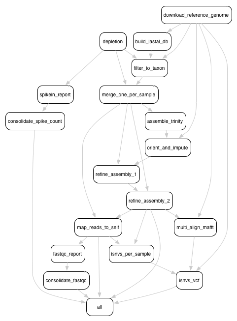

Using the Snakemake pipelines
=============================

Rather than chaining together viral-ngs pipeline steps as series of tool
commands called in isolation, it is possible to execute them as a
complete automated pipeline, from processing raw sequencer output to
creating files suitable for GenBank submission. This utilizes Snakemake,
which is documented at:
https://bitbucket.org/snakemake/snakemake/wiki/Home

Here is an overview of the Snakemake rule graph:

Setting up the Python 3 virtual environment
-------------------------------------------

Note that Python 3.4 is required to use these tools with Snakemake. It
is recommended to create a virtual environment within which all of the
viral-ngs dependencies can be installed:

::

    pyvenv-3.4 venv-viral-ngs
    cd venv-viral-ngs
    source bin/activate

Once the virtual environment has been created and activated, the
viral-ngs dependencies can be installed via ``pip``:

::

    pip install -r requirements.txt
    pip install -r requirements-pipes.txt

Note: To resume normal use of the system installation of python, call
the “deactivate” command in your shell. See the `official venv
documentation <https://docs.python.org/3/library/venv.html>`__ for more
information on Python3 virtual environments.

In addition to the dependencies installed via ``pip``, the pipline needs
the standard dependencies described in the main viral-ngs installation
section.

*Note:* If running on the Broad Institute UGER cluster environment,
import the following dotkits prior to activating the virtualenv:

::

    use .python-3.4.3
    use .oracle-java-jdk-1.7.0-51-x86-64
    use .bzip2-1.0.6
    use .zlib-1.2.6
    use .gcc-4.5.3

Setting up an analysis directory
--------------------------------

Copying and creating project directories and files
~~~~~~~~~~~~~~~~~~~~~~~~~~~~~~~~~~~~~~~~~~~~~~~~~~

The Snakemake pipline is intended to be run on an input one or more
sequencer bam files, each having a filename represending a sample name.
The output files are named with the same sample names, and are organized
into folders corresponding to the steps of the pipeline in which they
were created.

To get started, create an analysis directory somewhere in your compute
environment to contain the pipeline input and output files.

Into this directory, copy the following file from the ``viral-ngs/pipes``
directory:

::

    config.yaml
    Snakefile

Since the file ``config.yaml`` is project-specific, you will need to
make changes to it as approprate for your usage. The config file changes
are described in greater detail below.

Next, ``cd`` to the analysis directory and create symbolic links to the
following:

-  The viral-ngs virtual environment:

   ``ln -s /path/to/venv-viral-ngs venv``

-  The viral-ngs project, checked out from GitHub or extracted from a
   version-tagged archive:

   ``ln -s /path/to/viral-ngs bin``

Within the analysis directory, create the directories and files used by
the Snakemake pipeline:

::

    data/
        00_raw/
        01_cleaned/
        01_per_sample/
        02_align_to_self/
        02_assembly/
        03_align_to_ref/
        03_interhost/
        04_intrahost/
    log/
    reports/
    tmp/

The directory structure created needs to match the locations specified
in ``config.yaml``.

Adding input data
~~~~~~~~~~~~~~~~~

-  Copy each of the raw sample bam files to the ``00_raw/`` directory
   and ensure the file names follow the convention of ``{sample}.bam``.

-  Create a file, ``samples-depletion.txt``, to list all of the samples
   that should be run through the depletion pipeline, with one
   samplename per line as {sample}, following the format of the input
   bam file: ``{sample}.bam``. For example, if you copied a file called
   "G1190.bam" into ``00_raw/``, then then ``samples-depletion.txt``
   would contain the line:

   ``G1190``

-  Create a file, ``samples-assembly.txt``, to list all of the samples
   that should be run through the assembly pipeline.
-  Create a file, ``samples-runs.txt``, to list all of the samples that
   should be run through the int\ **er**\ host analysis pipeline.
-  Create a blank file, ``samples-assembly-failures.txt``, that may be
   filled in later.

Modifying the ``config.yaml`` file
~~~~~~~~~~~~~~~~~~~~~~~~~~~~~~~~~~

Minimal modification to the config file is necessary, though there are a
few things you need to specify:

An email address for when the pipeline fetches reference data from the
NCBI via their `Entrez
API <http://www.ncbi.nlm.nih.gov/books/NBK25501/>`__:

::

    email_point_of_contact_for_ncbi: "someone@example.com"

The path to the depletion databases to be used by BMTagger, along with
the file prefixes of the specific databases to use. The process for
creating BMTagger depletion databases is described in the `NIH BMTagger
docs <ftp://ftp.ncbi.nih.gov/pub/agarwala/bmtagger/README.bmtagger.txt>`__.

::

    bmtagger_db_dir: "/path/to/depletion_databases"
    bmtagger_dbs_remove:
      - "hg19"
      - "GRCh37.68_ncRNA-GRCh37.68_transcripts-HS_rRNA_mitRNA"
      - "metagenomics_contaminants_v3"

Pre-built depletion databases are available in both \*.tar.gz and \*.lz4 
format, for removing human reads and common metagenomic contaminants:

-  `GRCh37.68_ncRNA-GRCh37.68_transcripts-HS_rRNA_mitRNA.tar.gz <https://storage.googleapis.com/sabeti-public/depletion_dbs/GRCh37.68_ncRNA-GRCh37.68_transcripts-HS_rRNA_mitRNA.tar.gz>`__ (`*.lz4 <https://storage.googleapis.com/sabeti-public/depletion_dbs/GRCh37.68_ncRNA-GRCh37.68_transcripts-HS_rRNA_mitRNA.lz4>`__)
-  `hg19.tar.gz <https://storage.googleapis.com/sabeti-public/depletion_dbs/hg19.tar.gz>`__ (`*.lz4 <https://storage.googleapis.com/sabeti-public/depletion_dbs/hg19.lz4>`__)
-  `metagenomics_contaminants_v3.tar.gz <https://storage.googleapis.com/sabeti-public/depletion_dbs/metagenomics_contaminants_v3.tar.gz>`__ (`*.lz4 <https://storage.googleapis.com/sabeti-public/depletion_dbs/metagenomics_contaminants_v3.lz4>`__)

Note that these databases must be extracted prior to use.

In addition to the databases used by BMTagger, you will need to specify
the location and file prefix of the BLAST database to be used for
depletion. The process for creating the BLAST database is described in
the `NIH BLAST
docs <ftp://ftp.ncbi.nih.gov/blast/documents/formatdb.html>`__, and on
`this
website <http://www.compbio.ox.ac.uk/analysis_tools/BLAST/formatdb.shtml>`__
from the University of Oxford.

::

    blast_db_dir: "/path/to/depletion_databases"
    blast_db_remove: "metag_v3.ncRNA.mRNA.mitRNA.consensus"

A pre-built depletion database is also available for BLAST:

-  `metag_v3.ncRNA.mRNA.mitRNA.consensus.tar.gz <https://storage.googleapis.com/sabeti-public/depletion_dbs/metag_v3.ncRNA.mRNA.mitRNA.consensus.tar.gz>`__ (`*.lz4 <https://storage.googleapis.com/sabeti-public/depletion_dbs/metag_v3.ncRNA.mRNA.mitRNA.consensus.lz4>`__)

Note that this database must be extracted prior to use.

Additional databases are needed to perform metagenomic classification 
using `Kraken <https://ccb.jhu.edu/software/kraken/>`__, 
`Diamond <https://github.com/bbuchfink/diamond>`__, or 
`Krona <https://github.com/marbl/Krona/wiki>`__.

::

    kraken_db: "/path/to/kraken_full_20150910"

    diamond_db: "/path/to/diamond_db/nr"

    krona_db: "/path/to/krona"

Pre-built databases for Kraken, Diamond, and Krona are available:

-  `kraken_ercc_db_20160718.tar.gz <https://storage.googleapis.com/sabeti-public/meta_dbs/kraken_ercc_db_20160718.tar.gz>`__ including `ERCC spike-in RNA seqs <https://www.ncbi.nlm.nih.gov/pmc/articles/PMC3166838/>`__ (`*.lz4 <https://storage.googleapis.com/sabeti-public/meta_dbs/kraken_ercc_db_20160718.tar.lz4>`__)
-  `kraken_db.tar.gz <https://storage.googleapis.com/sabeti-public/meta_dbs/kraken_db.tar.gz>`__ (`*.lz4 <https://storage.googleapis.com/sabeti-public/meta_dbs/kraken_db.tar.lz4>`__)
-  `krona_taxonomy_20160502.tar.gz <https://storage.googleapis.com/sabeti-public/meta_dbs/krona_taxonomy_20160502.tar.gz>`__ (`*.lz4 <https://storage.googleapis.com/sabeti-public/meta_dbs/krona_taxonomy_20160502.tar.lz4>`__)
-  `nr.dmnd.gz <https://storage.googleapis.com/sabeti-public/meta_dbs/nr.dmnd.gz>`__ (`*.lz4 <https://storage.googleapis.com/sabeti-public/meta_dbs/nr.dmnd.lz4>`__)

Note that these databases must be extracted prior to use.

An array of the `NCBI GenBank
CoreNucleotide <http://www.ncbi.nlm.nih.gov/nuccore/>`__ accessions for
the sequences comprising the reference genome to be used for contig
assembly as well as for int\ **er**\ host and int\ **ra**\ host variant
analysis. In addition, you will need to specify a file prefix to be used
to represent the full reference genome file used downstream.

::

    accessions_for_ref_genome_build:
      - "KJ660346.2"

An optional file containing a list of accessions may be specified for
filtering reads via `LAST <http://last.cbrc.jp/doc/lastal.txt>`__. This is
intended to narrow to a genus. If this file is not provided, viral-ngs
defaults to using the accessions specified for the reference genome.

::

    accessions_file_for_lastal_db_build: "/path/to/lastal_accessions.txt"

A FASTA file to be used by Trimmomatic during assembly to remove
contaminents from reads:

::

    trim_clip_db: "/path/to/depletion_databases/contaminants.fasta"

Pre-built databases for Trimmomatic:

-  `contaminants.fasta.tar.gz <https://console.cloud.google.com/m/cloudstorage/b/sabeti-public/o/depletion_dbs/contaminants.fasta.tar.gz>`__ (`*.lz4 <https://console.cloud.google.com/m/cloudstorage/b/sabeti-public/o/depletion_dbs/contaminants.fasta.lz4>`__)

A FASTA file containing spike-ins to be reported:

::

    spikeins_db: "/path/to/references/ercc_spike-ins.fasta"

Modifying the ``Snakefile``
~~~~~~~~~~~~~~~~~~~~~~~~~~~

Depending on the state of your input data, and where in the pipeline it
may enter, it may be necessary to omit certain processing steps. For
example, if your sequencing center has already demultiplexed your data
and no demultiplexing is needed, you can comment out the following line
in the ``Snakefile``:

::

    include: os.path.join(pipesDir, 'demux.rules’)

Running the pipeline
--------------------

Configuring for your compute platform
~~~~~~~~~~~~~~~~~~~~~~~~~~~~~~~~~~~~~

Running the pipeline directly
~~~~~~~~~~~~~~~~~~~~~~~~~~~~~

After the above setup is complete, run the pipeline directly by calling
``snakemake`` within the analysis directory.

Running the pipeline on GridEngine (UGER)
~~~~~~~~~~~~~~~~~~~~~~~~~~~~~~~~~~~~~~~~~

Within ``config.yaml``, set the "project" to one that exists on the
cluster system.

Inside the analysis directory, run the job submission command. Ex.:

::

    use UGER
    qsub -cwd -b y -q long -l m_mem_free=4G ./bin/pipes/Broad_UGER/run-pipe.sh

To kill all jobs that exited (qstat status "Eqw") with an error:

::

    qdel $(qstat | grep Eqw | awk '{print $1}')

Running the pipeline on LSF
~~~~~~~~~~~~~~~~~~~~~~~~~~~

Inside the analysis directory, run the job submission command. Ex.:

::

    bsub -o log/run.out -q forest ./bin/pipes/Broad_LSF/run-pipe.sh

If you notice jobs hanging in the **PEND** state, an upstream job may
have failed. Before killing such jobs, verify that the jobs are pending
due to their dependency:

::

    bjobs -al | grep -A 1 "PENDING REASONS" | grep -v "PENDING REASONS" | grep -v '^--$'

To kill all **PEND**\ ing jobs:

::

    bkill `bjobs | grep PEND | awk '{print $1}'` > /dev/null

When things go wrong
~~~~~~~~~~~~~~~~~~~~

The pipeline may fail with errors during execution, usually while
generating assemblies with Trinity. If this occurs, examine the output,
add the failing sample names to ``samples-assembly-failures.txt``,
keeping the good ones in ``samples-assembly.txt``, and re-run the
pipeline. Due to sample degradation prior to sequencing in the wet lab,
not all samples have the integrity to complete the pipeline, and it may
necessary to skip over these samples by adding them to the
``samples-assembly-failures.txt``.

Assembly of pre-filtered reads
------------------------------

Taxonomic filtration of raw reads
---------------------------------

Starting from Illumina BCL directories
--------------------------------------

When starting from Illumina run directories, the viral-ngs Snakemake pipeline can demultiplex raw BCL files,
and merge samples from multiple flowcell lanes or libraries. To use viral-ngs in this way, create the following files:

``flowcells.txt`` (example below): A tab-delimited file describing the flowcells to demultiplex, as well as the lane to use, 
a path to the file listing the barcodes used in the lane, the ``bustard_dir`` (the run directory as written by an Illumina sequencer), 
and an optional column for ``max_mismatches``, which specifies how many bases are allowed to differ for a read to be assigned to a particular barcode (default: 0). The column ``max_mismatches`` may be omitted, including its header.

::

    flowcell        lane    barcode_file    bustard_dir     max_mismatches
    H32G3ADXY       1       /path/to/barcodes.txt    /path/to/illumina/run/directory/run_BH32G3ADXY 1
    H32G3ADXY       2       /path/to/barcodes.txt    /path/to/illumina/run/directory/run_BH32G3ADXY 1
    AKJ6R   1       /path/to/barcodes.txt      /path/to/illumina/run/directory/run_AKJ6R      1

``barcodes.txt`` (example below): A tab-delimited file describing the barcodes used for a given sample, along with a library ID.

::

    sample  barcode_1       barcode_2       library_id_per_sample
    41C     TAAGGCGA        TATCCTCT        AP2
    21P     CGTACTAG        TATCCTCT        AP2
    42C     AGGCAGAA        TATCCTCT        AP2
    41P     TCCTGAGC        TATCCTCT        AP2
    42P     GGACTCCT        TATCCTCT        AP2
    61C     TAGGCATG        TATCCTCT        AP2
    61P     CTCTCTAC        AGAGTAGA        AP2
    62C     CAGAGAGG        AGAGTAGA        AP2
    62P     GCTACGCT        AGAGTAGA        AP2
    142C    CGAGGCTG        AGAGTAGA        AP2
    WATERCTL        AAGAGGCA        AGAGTAGA        AP2

``samples-depletion.txt``: the list of sample names to deplete `as described above <#adding-input-data>`__.

